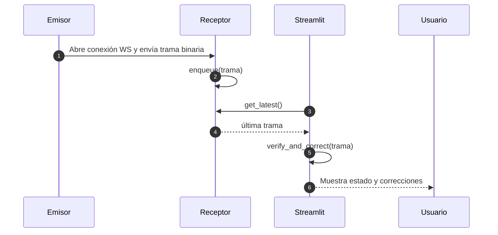

# Arquitectura del Sistema

Este documento describe los componentes, flujos de datos y decisiones de diseño de la solución de emisor–receptor con interfaz Streamlit.

---

## Tabla de Contenidos
1. [Visión General](#visión-general)  
2. [Componentes](#componentes)  
  1. [Emisor (Go)](#emisor-go)  
  2. [Receptor (Python)](#receptor-python)  
  3. [Interfaz de Usuario (Streamlit)](#interfaz-de-usuario-streamlit)  
3. [Flujo de Datos y Secuencia](#flujo-de-datos-y-secuencia)  
4. [Diagrama de Despliegue](#diagrama-de-despliegue)  
5. [Formato de la Trama](#formato-de-la-trama)  
6. [Puertos y Endpoints](#puertos-y-endpoints)  
7. [Consideraciones de Error y Recuperación](#consideraciones-de-error-y-recuperación)  

---

## 1. Visión General
El sistema consta de tres servicios independientes que se comunican por WebSocket en una red interna:

- **Emisor (Go)**
- **Receptor (Python)**
- **Interfaz de Usuario (Streamlit)**

---

## 2. Componentes

### 2.1 Emisor (Go)
- **Responsabilidad**: Generar tramas, aplicar CRC-32, Hamming u otros algoritmos y enviarlas por WebSocket.  
- **Módulos**:
  - `frame/encoder.go`: Construcción de bits de datos + CRC-32, Hamming, etc.  
  - `wsclient/client.go`: Cliente para conectar y enviar bytes a `ws://<host>:<port>`.  
- **Modo**: Actúa únicamente como cliente; no expone servidor.

### 2.2 Receptor (Python)
- **Responsabilidad**: Recibir tramas, verificar/corregir errores y exponer el resultado a la UI.  
- **Módulos**:
  - `algorithms.py`: `verify(frame: bytes) → Result` y `correct(frame) → (fixed, errors)`.  
  - `ws_client.py`: Cliente `asyncio` que escucha en `ws://<host>:<port>` y mantiene la última trama en una cola FIFO de tamaño 1.  
- **Modo**: Actúa únicamente como cliente; no expone servidor.

### 2.3 Interfaz de Usuario (Streamlit)
- **Responsabilidad**: Mostrar en tiempo real las tramas recibidas y sus resultados de verificación/corrección.  
- **Archivo principal**: `streamlit_app.py`  
- **Comunicación interna**: Ejecuta `ws_client` en hilo aparte y refresca la interfaz cada 0.5 s.

---

## 3. Flujo de Datos y Secuencia


1. Emisor construye la trama y se conecta a `ws://receptor:9000`.  
2. Receptor recibe y guarda los bytes en la cola.  
3. Streamlit solicita la última trama, la procesa y la muestra.

---

## 4. Diagrama de Despliegue

```text
┌───────────────┐       WebSocket       ┌────────────────┐
│  Emisor (Go)  │ ────────────────────> │ Receptor (Py)  │
│  (binario)    │                       │ + Streamlit UI │
└───────────────┘                       └────────────────┘
```

- **WS (9000)**: Emisor → Receptor  
- **HTTP (8501)**: Streamlit UI

---

## 5. Formato de la Trama
Estructura big-endian:

| Campo   | Tamaño     | Descripción                                              |
| ------- | ---------- | -------------------------------------------------------- |
| Header  | 2 bytes    | Byte 1: Tipo (0x01=datos, 0x02=control)<br>Byte 2: longitud (n) |
| Payload | n bytes    | Datos útiles                                             |
| CRC     | 4 bytes    | CRC-32 sobre Header+Payload                              |
| Hamming | m bits     | Opcional, según configuración                            |

Ejemplo:

```
01 05 48 65 6C 6C 6F A1 B2 C3 D4
```

---

## 6. Puertos y Endpoints
| Servicio          | Protocolo  | Endpoint                  | Puerto | Descripción                         |
| ----------------- | ---------- | ------------------------- | ------ | ----------------------------------- |
| Emisor (Go)       | WebSocket  | ws://<receptor>:9000      | 9000   | Envío de tramas binarias            |
| Receptor (Python) | WebSocket  | ws://<receptor>:9000      | 9000   | Recepción y procesamiento de tramas |
| Streamlit (UI)    | HTTP       | http://localhost:8501     | 8501   | Interfaz de monitoreo en tiempo real|

**Notas**:
- Configure el firewall para permitir tráfico en estos puertos.  
- El Emisor reintenta la conexión cada 2 s si falla.

---

## 7. Consideraciones de Error y Recuperación
- **Emisor**: Reintenta la conexión WS cada 2 s (configurable).  
- **Receptor**: En trama inválida, registra el error y conserva la última válida.  
- **Streamlit**: Muestra alertas de conexión y formato con opción de recargar.
